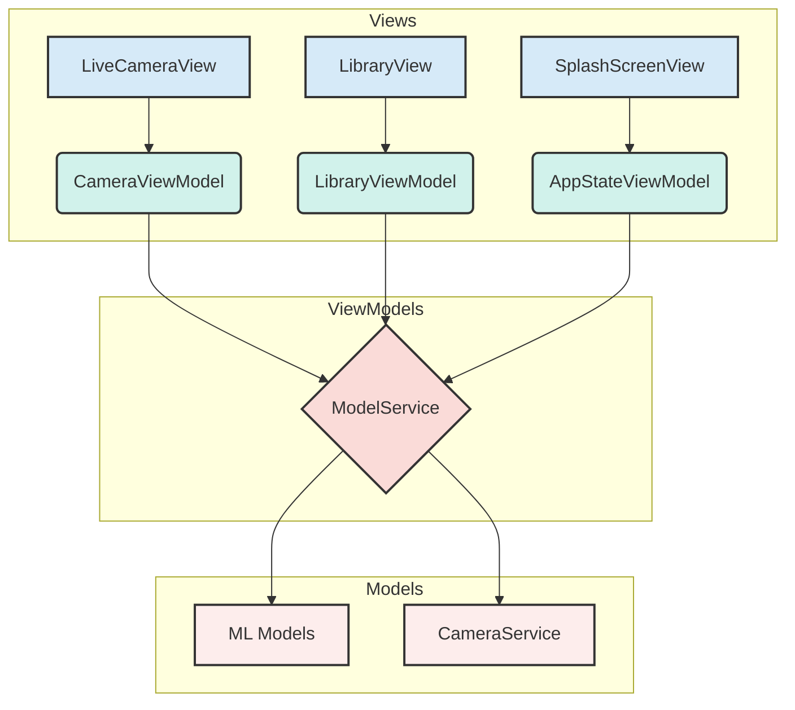

# 📸 Swift-Cam

AI-powered object recognition app for iOS using Core ML.

## Features

- 🤖 **Multiple ML Models**: MobileNet V2, ResNet-50, and FastViT
- 📷 **Live Camera**: Real-time object detection
- 🖼️ **Photo Library**: Analyze saved images
- ⚡ **Fast Preloading**: Models loaded during splash screen
- 🎨 **Modern UI**: Clean, Apple-style interface

## 🚀 Getting Started

### Prerequisites

- Xcode 15.0 or later
- iOS 17.0 or later
- Apple Developer account

### First-Time Setup

1. **Clone the repository:**
   ```bash
   git clone <your-repo-url>
   cd swift-cam
   ```

2. **Configure developer settings:**
   ```bash
   ./setup-developer.sh
   ```
   Or see [DEVELOPER_SETUP.md](Docs/DEVELOPER_SETUP.md) for manual setup.

3. **Open in Xcode:**
   ```bash
   open swift-cam.xcodeproj
   ```

4. **Build and run!** 🎉

**Note:** Camera and Photo Library permissions are already configured in the project. No additional Info.plist setup needed!

### For Returning Developers

Just pull and work - your developer settings are preserved:
```bash
git pull
# No reconfiguration needed!
```

## 📖 Documentation

- **[Developer Setup Guide](Docs/DEVELOPER_SETUP.md)** - Configure code signing (required for first-time setup)
- **[Repository Structure](Docs/REPOSITORY_STRUCTURE.md)** - What files to commit, Info.plist explained
- **[Quick Start](Docs/QUICK_START.md)** - TL;DR for getting started quickly
- **[Docs/](Docs/)** - Additional technical guides and design documentation
  - [Repository Q&A](Docs/REPOSITORY_QUESTIONS_ANSWERED.md) - Common questions answered
  - [Testing Guide](Docs/TESTING_GUIDE.md) - How to test the app
  - [Design Docs](Docs/) - Camera, UI, and ML implementation details

## 🏗️ Architecture

The app is built using the **Model-View-ViewModel (MVVM)** design pattern, which separates the UI from the business logic and data.



### 1. Model

*   **What it is:** The Model represents the data and business logic of the application. It's the "brains" of the operation, responsible for managing the app's data and performing the core tasks.
*   **In this project:**
    *   **Data Models:** `ClassificationResult.swift`, `MLModelType.swift`, `AppConstants.swift`
    *   **Services:** `ModelService.swift` (loads and manages ML models), `CameraService.swift` (manages the camera)

### 2. View

*   **What it is:** The View is the user interface (UI). It's what the user sees and interacts with. In SwiftUI, Views are declarative, meaning you describe what the UI should look like, and SwiftUI takes care of rendering it.
*   **In this project:** All the files in the `Views` directory.

### 3. ViewModel

*   **What it is:** The ViewModel acts as a bridge between the View and the Model. It takes the data from the Model and prepares it for the View to display. It also takes input from the View (like a button tap) and tells the Model what to do.
*   **In this project:**
    *   `AppStateViewModel.swift`: Manages the app's loading state.
    *   `CameraViewModel.swift`: Manages the live camera feed and real-time classification.
    *   `LibraryViewModel.swift`: Manages the classification of images from the photo library.

**Note:** Not every View needs a ViewModel. Simple, reusable components often don't, but more complex views (like screens) usually do to keep the code clean and organized.

## 🤝 Contributing

1. Clone the repo
2. Run `./setup-developer.sh` to configure your signing
3. Create a feature branch
4. Make your changes
5. Commit and push
6. Create a pull request

Your personal developer configuration (`DeveloperSettings.xcconfig`) won't be committed - each developer has their own.

## 🔒 Code Signing

This project uses per-developer configuration files to avoid signing conflicts:
- Each developer has their own `DeveloperSettings.xcconfig` (git-ignored)
- No more merge conflicts on Team IDs or Bundle Identifiers
- See [DEVELOPER_SETUP.md](Docs/DEVELOPER_SETUP.md) for details

## 📦 ML Models

The app includes three pre-compiled Core ML models:
- **MobileNetV2**: Efficient and fast
- **ResNet-50**: High accuracy
- **FastViT**: Vision Transformer architecture

Models are automatically compiled by Xcode during build and preloaded during the splash screen for optimal performance.

## 🐛 Troubleshooting

### Signing Issues
See [DEVELOPER_SETUP.md](Docs/DEVELOPER_SETUP.md) troubleshooting section.

### Build Errors
1. Clean build folder: `Cmd+Shift+K`
2. Check your `DeveloperSettings.xcconfig` exists
3. Verify you're logged into Xcode with your Apple ID

### Models Not Loading
Models are automatically included in the build. If you see errors:
1. Check the `.mlmodel` and `.mlpackage` files are in `swift-cam/` folder
2. Clean and rebuild the project

## 📄 License

[Your License Here]

## 👥 Authors

- Joshua Nöldeke
- [Contributors]

---

**Need help?** Check [DEVELOPER_SETUP.md](Docs/DEVELOPER_SETUP.md) or open an issue!